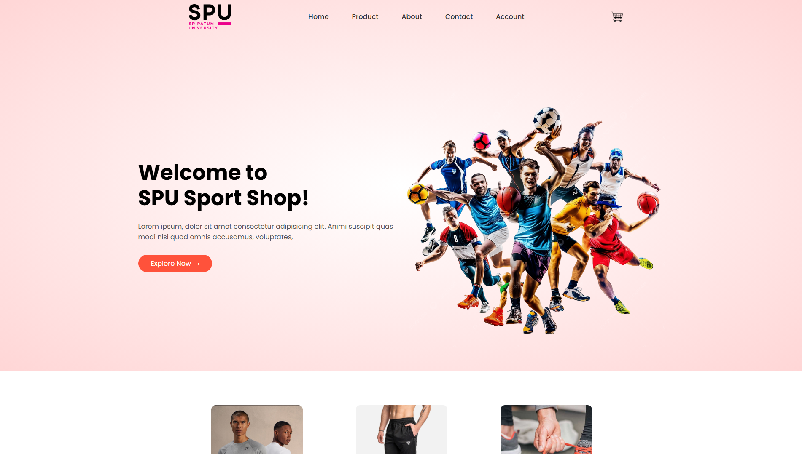
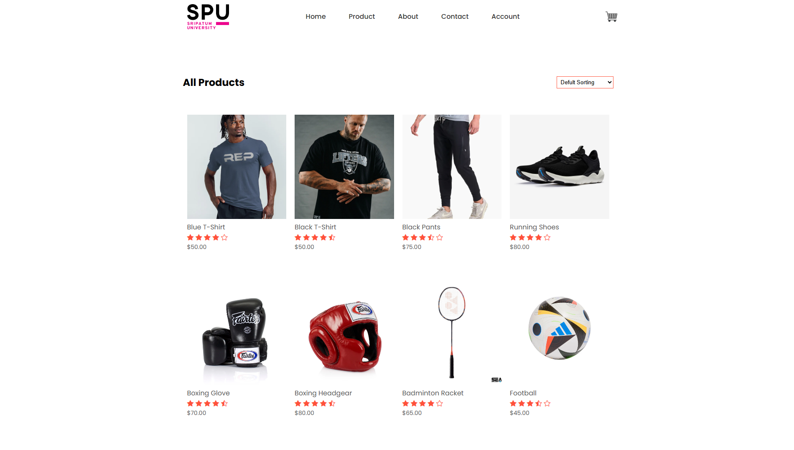
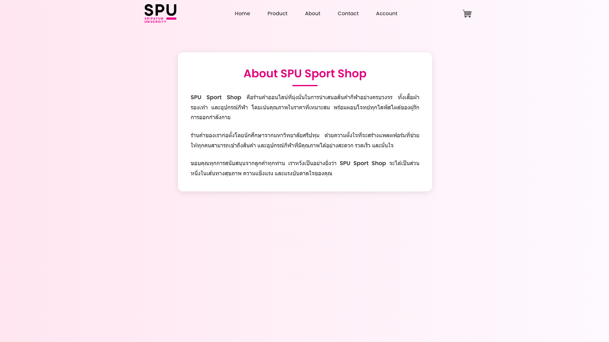
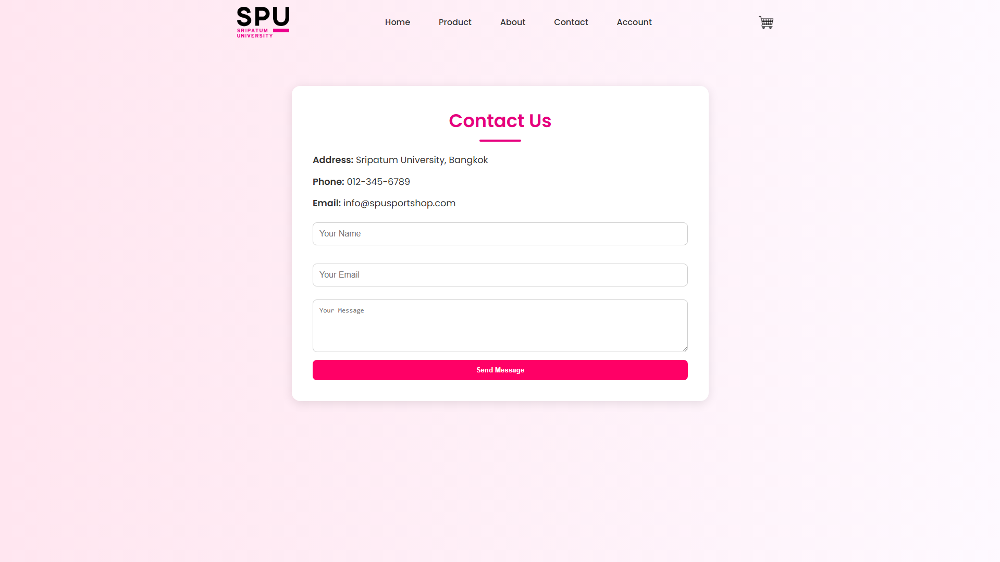
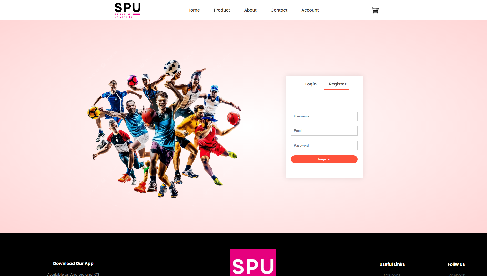
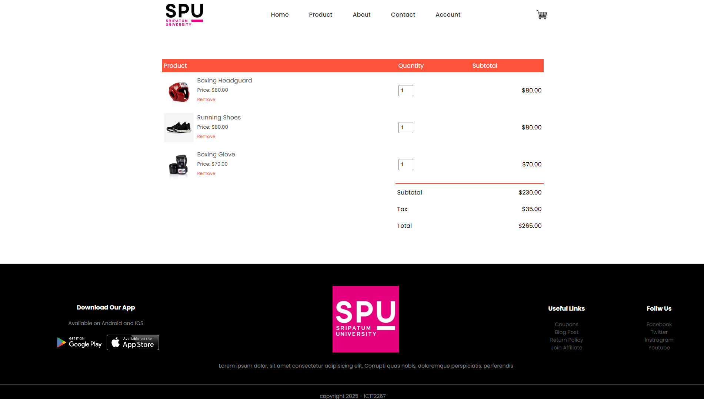

# ICT12267 Project 

จัดทำขึ้นเพื่อประกอบการเรียนรายวิชา **ICT12267**  
เนื้อหาเป็นเว็บไซต์ร้านค้าออนไลน์สำหรับแสดงสินค้า ตะกร้าสินค้า และหน้าข้อมูลต่าง ๆ

---

## 🔎 รายละเอียดโปรเจกต์

เว็บไซต์ประกอบด้วยหน้าเว็บหลักสำหรับร้านค้าออนไลน์ เช่น
- หน้าแสดงสินค้า

- หน้ารายละเอียดสินค้า

- หน้าเกี่ยวกับเรา

- หน้าติดต่อ

- หน้าเข้าสู่ระบบ / บัญชีผู้ใช้

- หน้าตะกร้าสินค้า


โปรเจกต์นี้เป็น **Static Website** (ไม่มี Backend และฐานข้อมูล)

---

## 🛠 เทคโนโลยีที่ใช้

- HTML 5  
- CSS 
- Bootstrap

---

## 📂 โครงสร้างไฟล์

```
ICT12267_Project/
│
├── index.html                            # หน้าแรก
├── product.html                          # หน้ารวมสินค้า
├── product-detial.html                   # หน้ารายละเอียดสินค้า
├── cart.html                             # หน้าตะกร้าสินค้า
├── account.html                          # หน้าเข้าสู่ระบบ/บัญชีผู้ใช้
├── about.html                            # หน้าเกี่ยวกับเรา
├── contact.html                          # หน้าติดต่อ
├── style.css                             # ไฟล์ CSS หลัก
└── Image                                 # โฟลเดอร์รูปภาพ
```
